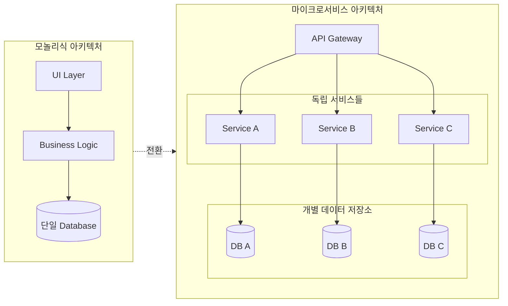
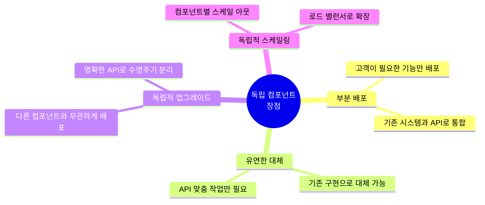
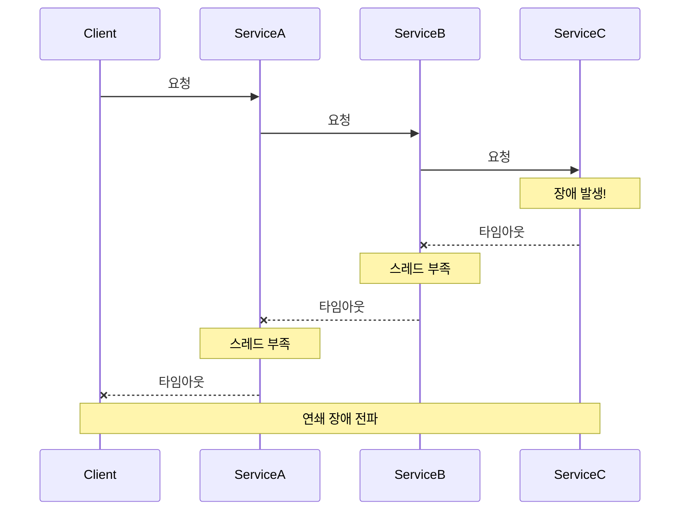
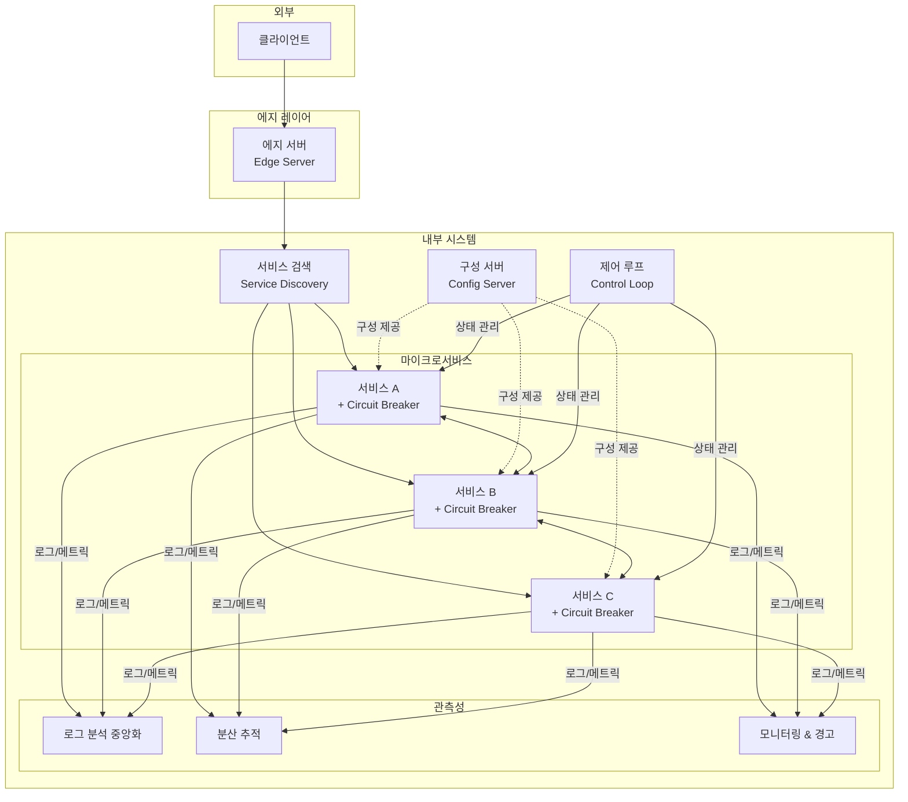
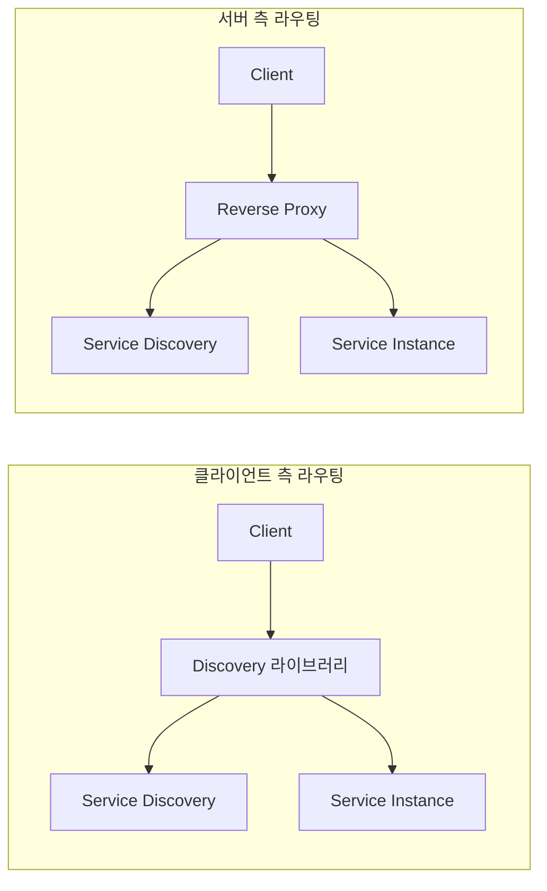
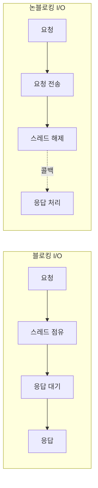
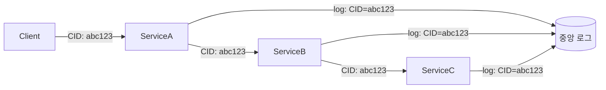
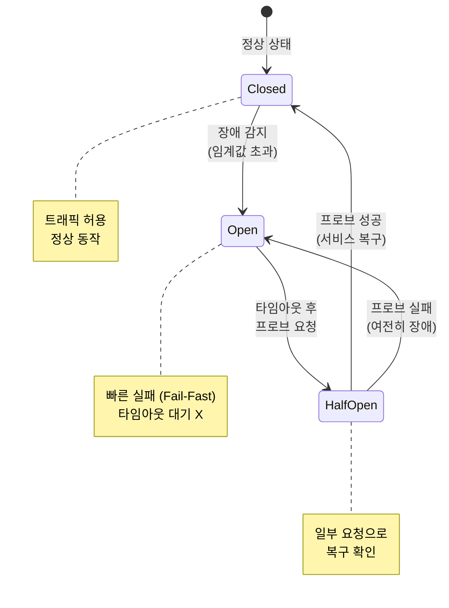
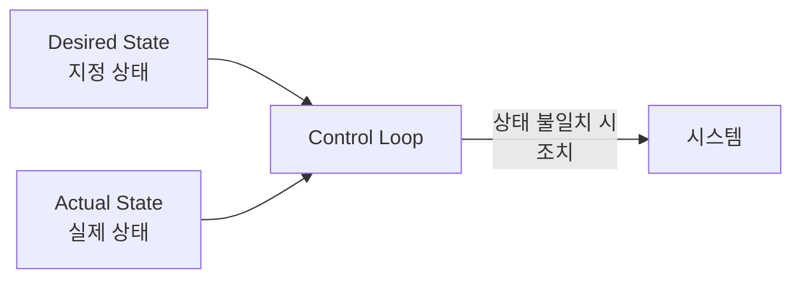

# Chapter 1. 마이크로서비스 소개

> 스프링으로 하는 마이크로서비스 구축 - Chapter 1 정리

## 목차

- [핵심 개념 요약](#핵심-개념-요약)
- [마이크로서비스란?](#마이크로서비스란)
- [독립 소프트웨어 컴포넌트](#독립-소프트웨어-컴포넌트)
- [마이크로서비스의 문제점](#마이크로서비스의-문제점)
- [디자인 패턴](#디자인-패턴)
- [기술 스택 매핑](#기술-스택-매핑)

---

## 핵심 개념 요약

```
┌─────────────────────────────────────────────────────────────────────┐
│                    마이크로서비스 핵심 원칙                           │
├─────────────────────────────────────────────────────────────────────┤
│  목표                                                               │
│    • 빠른 개발 & 지속적 배포                                         │
│    • 쉬운 스케일링 (수동/자동)                                       │
├─────────────────────────────────────────────────────────────────────┤
│  설계 원칙                                                           │
│    • 아무것도 공유하지 않는 아키텍처 (No Shared Database)             │
│    • 명확한 인터페이스를 통한 통신 (API/메시징)                       │
│    • 개별 런타임 프로세스로 배포 (Docker 컨테이너)                    │
│    • Stateless (상태 없음)                                          │
└─────────────────────────────────────────────────────────────────────┘
```

---

## 마이크로서비스란?

### 정의

> **마이크로서비스**는 독자적인 업그레이드와 스케일링이 가능한 **독립 소프트웨어 컴포넌트**다.

### 모놀리식 vs 마이크로서비스 아키텍처



### 마이크로서비스의 4가지 필수 기준

| 기준 | 설명 |
|------|------|
| **공유 없는 아키텍처** | 데이터베이스의 데이터를 공유하지 않음 |
| **명확한 인터페이스** | 동기 API 또는 비동기 메시징으로만 통신 |
| **독립 프로세스 배포** | Docker 컨테이너와 같이 독립된 런타임으로 실행 |
| **Stateless** | 어떤 인스턴스든 요청 처리 가능 |

### 적정 규모 기준

- 개발자가 다룰 수 있을 만한 크기
- 성능(대기 시간)이나 데이터 일관성을 저해하지 않을 정도

> **주의**: SQL 외래 키를 다른 마이크로서비스 데이터와 맺는 것은 더 이상 당연한 것이 아님

---

## 독립 소프트웨어 컴포넌트

### 장점



### 문제점

| 문제 | 설명 |
|------|------|
| **수동 구성의 어려움** | 로드 밸런서, 새 노드 설정에 시간 소요 & 오류 발생 가능 |
| **연쇄 장애 (Chain of Failure)** | 한 컴포넌트 중단 → 클라이언트 중단 → 전체 시스템 영향 |
| **구성 일관성** | 모든 인스턴스의 구성을 최신 상태로 유지하기 어려움 |
| **모니터링 복잡성** | 다수의 인스턴스 상태 파악이 어려움 |
| **로그 수집 어려움** | 분산된 로그 파일 수집 & 상관관계 분석 어려움 |

---

## 마이크로서비스의 문제점

### 연쇄 장애 (Chain of Failure)



### 분산 컴퓨팅의 8가지 오류 (Peter Deutsch, 1994)

> 분산 애플리케이션을 처음 구축할 때 누구나 하는 **잘못된 가정들**

| # | 잘못된 가정 |
|---|------------|
| 1 | 네트워크는 신뢰할 수 있다 |
| 2 | 네트워크 지연은 0이다 |
| 3 | 대역폭은 무한하다 |
| 4 | 네트워크는 안전하다 |
| 5 | 토폴로지는 변하지 않는다 |
| 6 | 관리자는 1명이다 |
| 7 | 전송비용은 0이다 |
| 8 | 네트워크는 균일하다 |

> **설계 원칙**: 시스템 환경에 항상 문제가 있다는 가정을 기반으로 설계할 것!

---

## 디자인 패턴

### 전체 아키텍처 개요



---

### 1. 서비스 검색 (Service Discovery)

| 구분 | 내용 |
|------|------|
| **문제** | 동적 IP를 가진 마이크로서비스 인스턴스를 클라이언트가 찾기 어려움 |
| **해결** | 사용 가능한 서비스/인스턴스를 추적하는 검색 서비스 추가 |

**구현 전략**



**필요 조건**
- 자동 등록/해지
- 논리 엔드포인트 → 실제 인스턴스 라우팅
- 로드 밸런싱
- 비정상 인스턴스 감지

---

### 2. 에지 서버 (Edge Server)

| 구분 | 내용 |
|------|------|
| **문제** | 일부 서비스만 외부 공개, 나머지는 숨기고 보호 필요 |
| **해결** | 모든 외부 요청이 거치는 에지 서버 추가 |

**필요 조건**
- 내부 서비스 숨김 (외부 허용 서비스만 라우팅)
- 보안: OAuth, OIDC, JWT, API 키 등으로 인증

---

### 3. 리액티브 마이크로서비스

| 구분 | 내용 |
|------|------|
| **문제** | 블로킹 I/O로 인한 스레드 부족 → 연쇄 장애 |
| **해결** | 논블로킹 I/O 사용으로 스레드 점유 방지 |

**블로킹 vs 논블로킹 I/O**



**필요 조건**
- 비동기 프로그래밍 모델 (메시지 전송 후 대기 X)
- 리액티브 프레임워크 사용
- 자가 치유 (Self-healing) 설계

---

### 4. 구성 중앙화 (Central Configuration)

| 구분 | 내용 |
|------|------|
| **문제** | 다수 인스턴스의 구성 정보 파악 & 업데이트 어려움 |
| **해결** | 모든 구성을 저장하는 구성 서버 추가 |

**필요 조건**
- 한 곳에서 구성 관리
- 환경별 설정 지원 (dev, test, staging, prod)

---

### 5. 로그 분석 중앙화

| 구분 | 내용 |
|------|------|
| **문제** | 분산된 로그 파일로 전체 현황 파악 어려움 |
| **해결** | 로그 수집/저장/분석 컴포넌트 추가 |

**필요 기능**
- 새 인스턴스 자동 감지 & 로그 수집
- 구조화된 검색 가능한 형식으로 저장
- 조회/분석 API & 그래픽 도구 제공

---

### 6. 분산 추적 (Distributed Tracing)

| 구분 | 내용 |
|------|------|
| **문제** | 마이크로서비스 간 요청 흐름 추적 어려움 |
| **해결** | 모든 요청/메시지에 **상관 ID (Correlation ID)** 추가 |



**필요 조건**
- 모든 수신 요청에 고유 상관 ID 할당
- 외부 요청 시 상관 ID 전파
- 로그에 상관 ID 포함 → 검색 가능

---

### 7. 서킷 브레이커 (Circuit Breaker)

| 구분 | 내용 |
|------|------|
| **문제** | 동기 통신에서 한 서비스 장애 → 연쇄 장애 |
| **해결** | 문제 감지 시 요청 차단하는 서킷 브레이커 추가 |

**서킷 브레이커 상태 다이어그램**



**상태 설명**

| 상태 | 동작 |
|------|------|
| **Closed** | 정상 - 모든 요청 허용 |
| **Open** | 장애 감지 - 즉시 실패 반환 (Fail-Fast) |
| **Half-Open** | 복구 확인 - 일부 요청으로 테스트 |

---

### 8. 제어 루프 (Control Loop)

| 구분 | 내용 |
|------|------|
| **문제** | 중단/지연된 인스턴스 수동 감지 어려움 |
| **해결** | 지정 상태 vs 실제 상태를 지속 관찰하는 컴포넌트 추가 |



---

### 9. 모니터링 및 경고 중앙화

| 구분 | 내용 |
|------|------|
| **문제** | 응답 시간, 리소스 사용량 문제의 근본 원인 파악 어려움 |
| **해결** | 하드웨어 메트릭 수집하는 모니터 서비스 추가 |

**필요 조건**
- 오토스케일링 포함 모든 서버의 메트릭 수집
- 새 인스턴스 자동 감지 & 메트릭 수집
- 조회/분석 API & 그래픽 도구 제공

---

## 기술 스택 매핑

### 디자인 패턴별 구현 기술

```mermaid
flowchart TB
    subgraph Patterns["디자인 패턴"]
        P1[서비스 검색]
        P2[에지 서버]
        P3[리액티브]
        P4[구성 중앙화]
        P5[로그 분석]
        P6[분산 추적]
        P7[서킷 브레이커]
        P8[제어 루프]
        P9[모니터링]
    end

    subgraph Spring["Spring 생태계"]
        SC1[Netflix Eureka + Ribbon]
        SC2[Spring Cloud Gateway<br/>+ Spring Security OAuth]
        SC3[Spring Reactor<br/>+ WebFlux]
        SC4[Spring Config Server]
        SC6[Spring Cloud Sleuth<br/>+ Zipkin]
        SC7[Resilience4j]
    end

    subgraph K8s["Kubernetes"]
        K1[kube-proxy + Service]
        K2[Ingress Controller]
        K4[ConfigMap + Secret]
        K5[EFK Stack]
        K8[Controller Manager]
        K9[Prometheus + Grafana]
    end

    subgraph Istio["Istio"]
        I2[Ingress Gateway]
        I6[Jaeger]
        I7[Outlier Detection]
        I9[Kiali]
    end

    P1 --> SC1 & K1
    P2 --> SC2 & K2 & I2
    P3 --> SC3
    P4 --> SC4 & K4
    P5 --> K5
    P6 --> SC6 & I6
    P7 --> SC7 & I7
    P8 --> K8
    P9 --> K9 & I9
```



### 상세 매핑 표

| 디자인 패턴 | Spring Boot | Spring Cloud | Kubernetes | Istio |
|------------|-------------|--------------|------------|-------|
| **서비스 검색** | - | Netflix Eureka, Ribbon | kube-proxy, Service | - |
| **에지 서버** | - | Spring Cloud Gateway, Spring Security OAuth | Ingress Controller | Ingress Gateway |
| **리액티브** | Spring Reactor, WebFlux | - | - | - |
| **구성 중앙화** | - | Spring Config Server | ConfigMap, Secret | - |
| **로그 분석** | - | - | EFK (Elasticsearch, Fluentd, Kibana) | - |
| **분산 추적** | - | Spring Cloud Sleuth, Zipkin | - | Jaeger |
| **서킷 브레이커** | - | Resilience4j | - | Outlier Detection |
| **제어 루프** | - | - | Controller Manager | - |
| **모니터링** | - | - | Prometheus, Grafana | Kiali, Prometheus, Grafana |

---

## 핵심 도구 요약

| 도구 | 설명 |
|------|------|
| **Spring Cloud** | Netflix OSS 래핑. 동적 서비스 검색, 구성 관리, 분산 추적, 서킷 브레이커 제공 |
| **Docker** | 개발/상용 환경 간격 최소화. 컨테이너 이미지로 패키징 & 실행 |
| **Kubernetes** | 컨테이너 오케스트레이션 사실상 표준 (2018~). 고가용성, 오토스케일링, 컴퓨팅 자원 관리 |
| **Service Mesh (Istio)** | 컨테이너 오케스트레이터 보완. 마이크로서비스 관리 편의성 & 탄력성 향상 |

---

## 참고 자료

- [C4 모델 규약](https://c4model.com) - 소프트웨어 아키텍처 시각화
- 분산 컴퓨팅의 8가지 오류 (Peter Deutsch, 1994)
