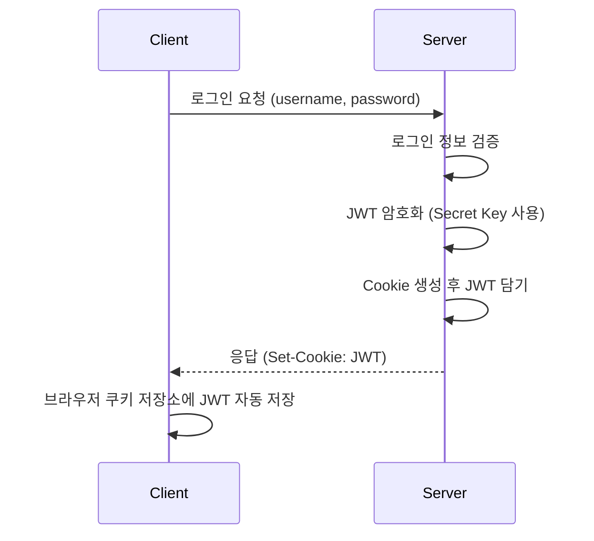
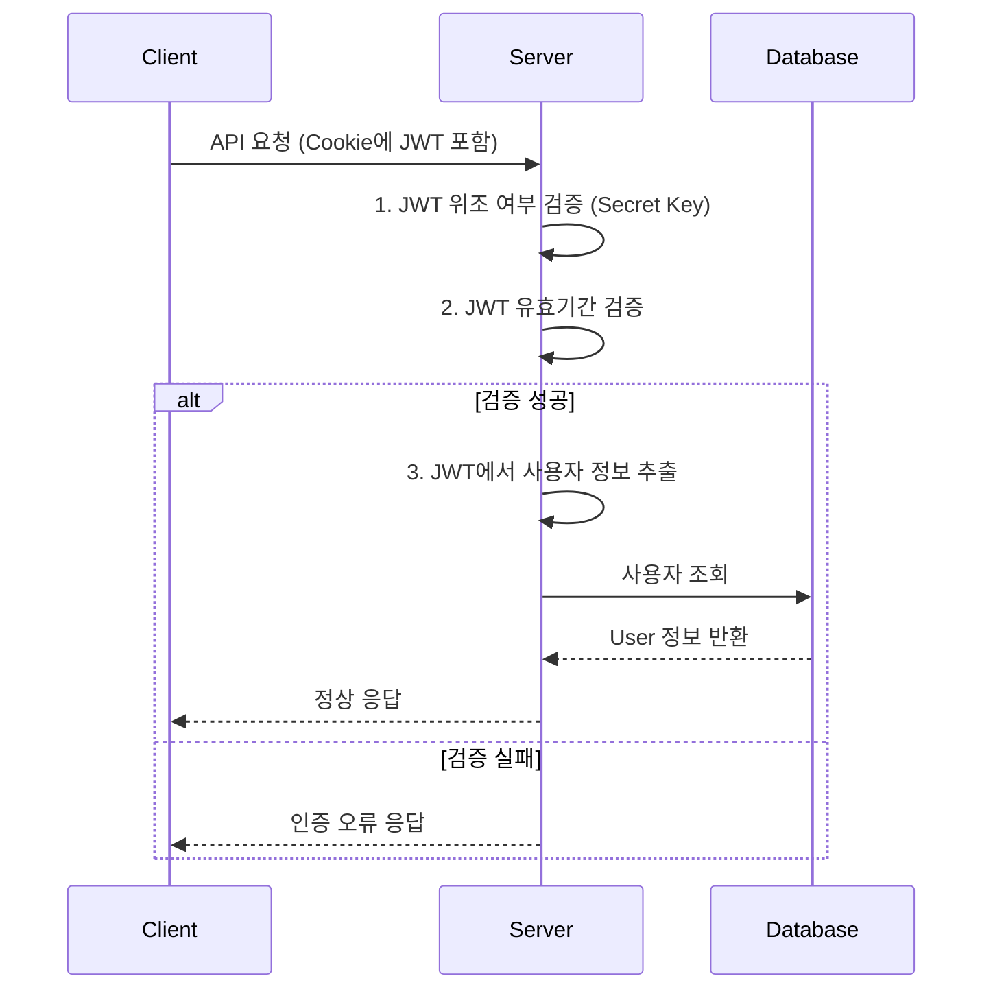
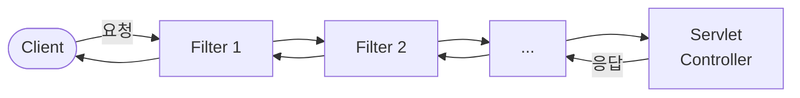
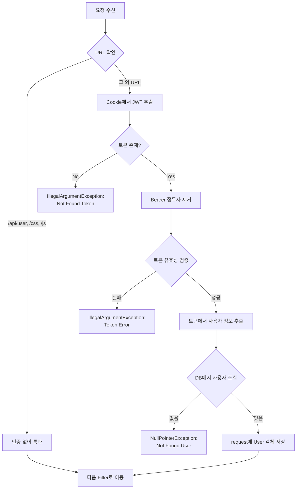
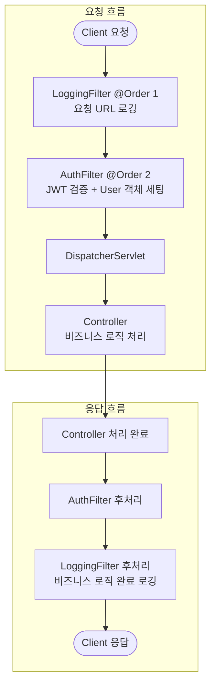

# 내일배움캠프 - Spring 숙련 주차 챕터1

---

## 1. JWT (JSON Web Token)

### 1-1. JWT란?

JWT(Json Web Token)란 **JSON 포맷을 이용하여 사용자에 대한 속성을 저장하는 Claim 기반의 Web Token**이다.
즉, 토큰의 한 종류이며, 일반적으로 **쿠키 저장소**를 사용하여 JWT를 저장한다.

### 1-2. JWT 사용 이유

#### 서버가 1대인 경우

- Session 1개가 모든 Client의 로그인 정보를 소유하고 있으므로 문제가 없다.

#### 서버가 2대 이상인 경우 (문제 발생)

- 대용량 트래픽 처리를 위해 서버를 2대 이상 운영할 수 있다.
- 각 Session마다 **다른 Client 로그인 정보**를 가지고 있을 수 있다.
- Client1의 로그인 정보를 가지고 있지 않은 Server2나 Server3에 API 요청 시 **인증 실패** 문제가 발생한다.

**해결 방법:**

| 방법 | 설명 | 단점 |
|------|------|------|
| **Sticky Session** | Client마다 요청 Server를 고정 | 특정 서버에 부하 집중 가능 |
| **세션 저장소 생성** | 별도 Session Storage에 모든 세션 저장 | 저장소 장애 시 전체 영향, 네트워크 지연 |
| **JWT 사용** | 로그인 정보를 Client에 JWT로 암호화하여 저장 | 아래 단점 참고 |

#### JWT 방식의 핵심

- 로그인 정보를 **Server에 저장하지 않고**, Client에 JWT로 암호화하여 저장한다.
- 모든 서버에서 **동일한 Secret Key**를 소유하고, 이를 통해 암호화 및 위조 검증(복호화)을 수행한다.

#### JWT 장단점

| 구분 | 내용 |
|------|------|
| **장점** | 동시 접속자가 많을 때 서버 측 부하를 낮춤 (DB 조회 없이 서버 자체에서 검증 가능) |
| **장점** | Client와 Server가 다른 도메인을 사용할 때 유리 (예: 카카오 OAuth2 로그인) |
| **단점** | 구현의 복잡도 증가 |
| **단점** | JWT에 담는 내용이 커질수록 네트워크 비용 증가 |
| **단점** | 기 생성된 JWT를 일부만 만료시킬 방법이 없음 |
| **단점** | Secret Key 유출 시 JWT 조작 가능 |

### 1-3. JWT 구조

> JWT 디버깅 및 구조 확인: https://jwt.io/

JWT는 `.`으로 구분된 3개의 파트로 구성된다: **Header.Payload.Signature**

#### 1) Header - 알고리즘 및 토큰 타입 정보

```json
{
  "alg": "HS256",
  "typ": "JWT"
}
```

#### 2) Payload - 실제 사용자 정보 (Claims)

```json
{
  "sub": "1234567890",
  "username": "카즈하",
  "admin": true
}
```

#### 3) Signature - 위조 방지를 위한 서명

```
HMACSHA256(
  base64UrlEncode(header) + "." +
  base64UrlEncode(payload),
  secret
)
```

> **핵심:** JWT는 누구나 평문으로 복호화(디코딩) 가능하지만, Secret Key가 없으면 **수정(위조)이 불가능**하다.
> 즉, JWT는 **Read-Only 데이터**이다.

### 1-4. JWT 사용 흐름

#### Step 1: 로그인 시 JWT 발급



**JWT를 Cookie에 담아 전달하는 코드:**

```java
Cookie cookie = new Cookie(AUTHORIZATION_HEADER, token); // Name-Value
cookie.setPath("/");

// Response 객체에 Cookie 추가
res.addCookie(cookie);
```

#### Step 2: 이후 API 요청 시 JWT 인증



**Cookie에서 JWT를 추출하는 코드:**

```java
// HttpServletRequest에서 Cookie Value(JWT) 가져오기
public String getTokenFromRequest(HttpServletRequest req) {
    Cookie[] cookies = req.getCookies();
    if (cookies != null) {
        for (Cookie cookie : cookies) {
            if (cookie.getName().equals(AUTHORIZATION_HEADER)) {
                try {
                    // Encode 되어 넘어간 Value를 다시 Decode
                    return URLDecoder.decode(cookie.getValue(), "UTF-8");
                } catch (UnsupportedEncodingException e) {
                    return null;
                }
            }
        }
    }
    return null;
}
```

- 쿠키에 담긴 정보가 여러 개일 수 있으므로, JWT가 담긴 쿠키의 이름(`AUTHORIZATION_HEADER`)과 일치하는 것을 찾아 반환한다.

---

## 2. Filter

### 2-1. Filter란?

Filter란 **Web 애플리케이션에서 관리되는 영역**으로, Client로부터 오는 요청과 응답에 대해 **최초/최종 단계**에서 처리하는 컴포넌트이다.



**Filter의 주요 용도:**

- 범용적인 작업 처리 (로깅, 보안 처리)
- **인증/인가** 관련 로직 처리
- 인증/인가 로직을 **비즈니스 로직과 분리**하여 관리 가능

### 2-2. Filter Chain

- Filter는 한 개만 존재하는 것이 아니라 여러 개가 **Chain 형식**으로 묶여서 순서대로 처리된다.
- `@Order` 어노테이션으로 실행 순서를 지정한다.
- `chain.doFilter(request, response)`를 호출하여 다음 Filter로 이동시킨다.

### 2-3. Filter 구현 예제

#### 1) LoggingFilter - 요청 URL 로깅 필터

```java
package com.sparta.springauth.filter;

import jakarta.servlet.*;
import jakarta.servlet.http.HttpServletRequest;
import lombok.extern.slf4j.Slf4j;
import org.springframework.core.annotation.Order;
import org.springframework.stereotype.Component;

import java.io.IOException;

@Slf4j(topic = "LoggingFilter")
@Component
@Order(1)  // 첫 번째로 실행되는 필터
public class LoggingFilter implements Filter {
    @Override
    public void doFilter(ServletRequest request, ServletResponse response, FilterChain chain)
            throws IOException, ServletException {
        // 전처리
        HttpServletRequest httpServletRequest = (HttpServletRequest) request;
        String url = httpServletRequest.getRequestURI();
        log.info(url);

        chain.doFilter(request, response); // 다음 Filter로 이동

        // 후처리 (Controller 처리 완료 후 응답 전에 실행)
        log.info("비즈니스 로직 완료");
    }
}
```

**핵심 포인트:**
- `@Order(1)` : 필터의 실행 순서를 지정 (숫자가 작을수록 먼저 실행)
- `chain.doFilter(request, response)` : 다음 Filter로 이동 (없으면 Servlet으로 이동)
- `chain.doFilter()` **이후의 코드**는 비즈니스 로직 완료 후 Client 응답 전에 실행됨

#### 2) AuthFilter - 인증 및 인가 처리 필터

```java
package com.sparta.springauth.filter;

import com.sparta.springauth.entity.User;
import com.sparta.springauth.jwt.JwtUtil;
import com.sparta.springauth.repository.UserRepository;
import io.jsonwebtoken.Claims;
import jakarta.servlet.*;
import jakarta.servlet.http.HttpServletRequest;
import lombok.extern.slf4j.Slf4j;
import org.springframework.core.annotation.Order;
import org.springframework.stereotype.Component;
import org.springframework.util.StringUtils;

import java.io.IOException;

@Slf4j(topic = "AuthFilter")
@Component
@Order(2)  // 두 번째로 실행되는 필터 (LoggingFilter 이후)
public class AuthFilter implements Filter {

    private final UserRepository userRepository;
    private final JwtUtil jwtUtil;

    public AuthFilter(UserRepository userRepository, JwtUtil jwtUtil) {
        this.userRepository = userRepository;
        this.jwtUtil = jwtUtil;
    }

    @Override
    public void doFilter(ServletRequest request, ServletResponse response, FilterChain chain)
            throws IOException, ServletException {
        HttpServletRequest httpServletRequest = (HttpServletRequest) request;
        String url = httpServletRequest.getRequestURI();

        if (StringUtils.hasText(url) &&
                (url.startsWith("/api/user") || url.startsWith("/css") || url.startsWith("/js"))
        ) {
            // 회원가입, 로그인 관련 API는 인증 없이 요청 진행
            chain.doFilter(request, response);
        } else {
            // 나머지 API 요청은 인증 처리 진행
            String tokenValue = jwtUtil.getTokenFromRequest(httpServletRequest);

            if (StringUtils.hasText(tokenValue)) {
                // JWT 토큰에서 "Bearer " 접두사 제거
                String token = jwtUtil.substringToken(tokenValue);

                // 토큰 검증
                if (!jwtUtil.validateToken(token)) {
                    throw new IllegalArgumentException("Token Error");
                }

                // 토큰에서 사용자 정보 가져오기
                Claims info = jwtUtil.getUserInfoFromToken(token);

                // DB에서 사용자 존재 여부 확인
                User user = userRepository.findByUsername(info.getSubject()).orElseThrow(() ->
                        new NullPointerException("Not Found User")
                );

                // 인증 완료된 User 객체를 request에 저장
                request.setAttribute("user", user);
                chain.doFilter(request, response);
            } else {
                throw new IllegalArgumentException("Not Found Token");
            }
        }
    }
}
```

**AuthFilter 동작 흐름:**



### 2-4. Controller에서 인증된 사용자 정보 사용

Filter에서 인증 처리 후 `request.setAttribute("user", user)`로 저장한 User 객체를 Controller에서 꺼내 사용한다.

```java
package com.sparta.springauth.controller;

import com.sparta.springauth.entity.User;
import jakarta.servlet.http.HttpServletRequest;
import org.springframework.stereotype.Controller;
import org.springframework.web.bind.annotation.GetMapping;
import org.springframework.web.bind.annotation.RequestMapping;

@Controller
@RequestMapping("/api")
public class ProductController {

    @GetMapping("/products")
    public String getProducts(HttpServletRequest req) {
        System.out.println("ProductController.getProducts : 인증 완료");
        User user = (User) req.getAttribute("user");
        System.out.println("user.getUsername() = " + user.getUsername());

        return "redirect:/";
    }
}
```

- Filter에서 인증 처리되어 넘어온 `User` 객체를 사용하면, **해당 사용자가 등록한 제품만 조회**하는 등의 사용자별 데이터 처리가 가능하다.

---

## 전체 요청 흐름 정리


