# SQLlite3 실습 

### <span style="color:blue">DB 생성하기</span>

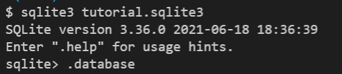

```bash
$ sqlite3 tutorial.sqlite3 #있으면 열고, 없으면 해당 이름으로 생성
```

```sqlite
.database -- '.'은 sqlite 프로그램의 기능을 실행 -> DB 생성 --
```


> **CSV 파일을 table로 만들기**

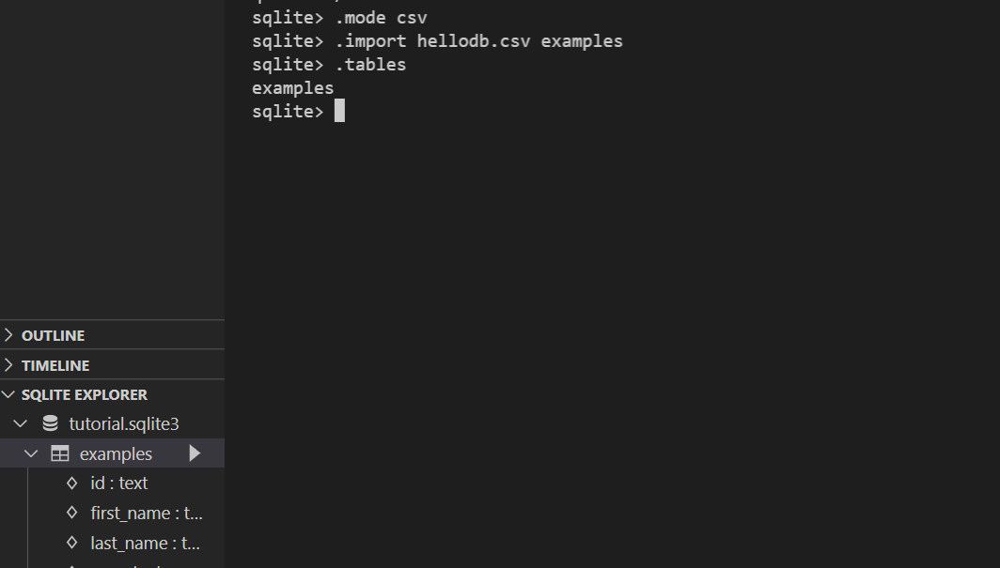

```sqlite
.mode csv --데이터를 csv 형식으로 출력--
.import hellodb.csv examples -- examples 라는 테이블 생성 -- 
.tables -- 현재 DB에 있는 테이블 보여줌

-- SELECT 를 통해 특정 테이블의 레코드(행) 정보 반환하기 --
SELECT * FROM exmples; -- ;까지 해야 SQL 명령 쿼리로 완성됨 --
```

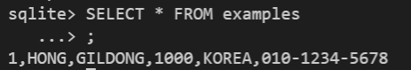

> 터미널 view 변경하기

```sqlite
.headers on
.mode column -- column 형태로 데이터 view
```

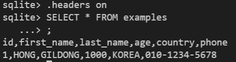

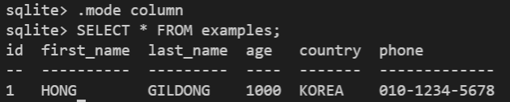


> **table 생성 및 삭제**

- CREATE

```sqlite
CREATE TABLE friends (id INTEGER PRIMARY KEY, name TEXT);
```


- 특정 테이블의 schema 조회

```sqlite
.schema friends
```

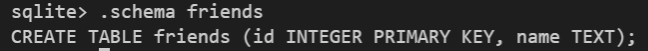

- DROP

```sqlite
DROP TABLE friends;
```


- 테이블 생성 실습

```sqlite
CREATE TABLE phonebook (name TEXT, age INT, phonenum TEXT);
```

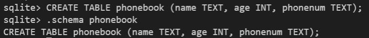


### <span style="color:blue">CRUD (e.g. DML : Data Manipulation Language) 로직 실습</span>

> CREATE

- INSERT : 테이블에 단일 행 삽입

Q : phonebook 테이블에 이름이 홍길동이고 나이 999살, 전화번호 : 010-1234-5678인 데이터 넣기

```sqlite
INSERT INTO phonebook (name, age, phonenum) VALUES ('홍길동', 999, '010-1234-5678');
```

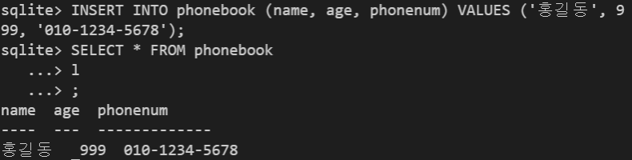

```sqlite
INSERT INTO phonebook VALUES ('홍길동', 1000, '010-1234-5678'); -- 모든 열에 데이터가 있는 경우 column을 명시하지 않아도 됨! --
```

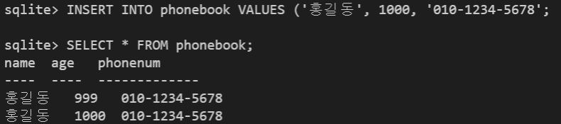


- id는 어디에 있지? -> rowid로 SQLite가 따로 관리

```sqlite
SELECT rowid, * FROM phonebook;
```


> NULL

- 꼭 필요한 정보라면 공백으로 비워두면 안되기 때문에 NOT NULL 설정이 필요하다.

```sqlite
DROP TABLE phonebook
CREATE TABLE phonebook(id INTEGER PRIMARY KEY, name TEXT NOT NULL, age INT NOT NULL, phonenum TEXT NOT NULL);
```


> SELECT와 같이 사용하는 clause

- LIMIT

  - 쿼리에서 반환되는 행 수를 제한

  - 특정 행부터 시작해서 조회하기 위해 `OFFSET`키워드와 함께 사용하기도 함

```sqlite
SELECT * FROM phonebook LIMIT 2;
```

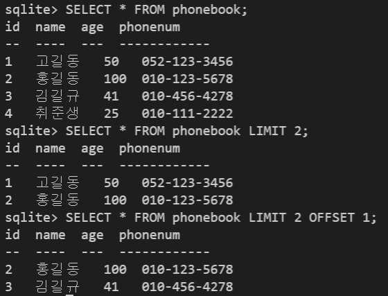

- Where
  - 쿼리에서 반환된 행에 대한 특정 검색 조건을 지정

```sqlite
SELECT * FROM phonebook WHERE phonebook.name LIKE '홍%'; 
```


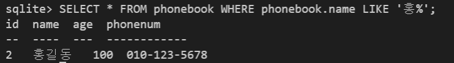

- SELECT DISTINCT
  - 조회 결과에서 중복 행을 제거
  - DISINCT 절을 SELECT 키워드 바로 뒤에 작성해야 함

```sqlite
SELECT DISTINCT name FROM phonebook;
```


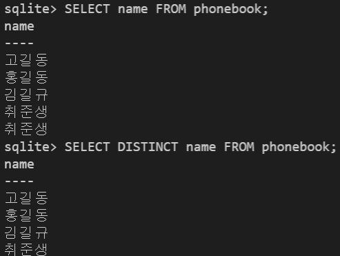


> DELETE

- 테이블에서 행을 제거

Q: phonebook 테이블에서 id가 5인 레코드를 삭제하시오.

A : `DELETE FROM phonebook WHERE id='5';`

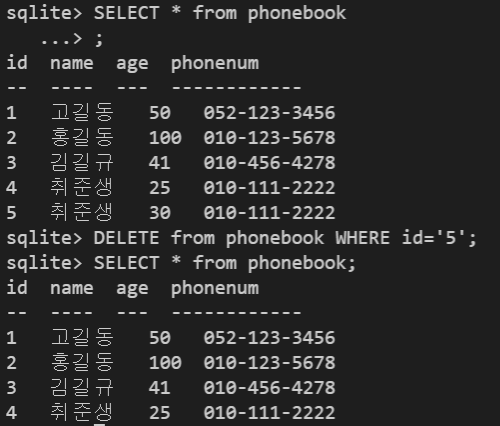

- SQLite에서는 지워진 키를 재사용할 수 있음(기본적인 `rowid`인 경우에도)


> AUTOINCREMENT

- SQLite가 사용되지 않은 값이나 이전에 삭제된 행의 값을 재사용하는 것을 방지

```sqlite
CREATE TABLE 테이블이름 (id INTEGER PRIMARY KEY AUTOINCREMENT, ...);
-- 테이블을 생성하는 단계에서 AUTOINCREMENT를 통해 설정 가능 --
```


> UPDATE

- 기존 행의 데이터를 수정
- `SET` clause에서 테이블의 각 열에 대해 새로운 값을 설정
- `UPDATE 테이블이름 SET 컬럼1=값1, 컬럼2=값2, ... WHERE 조건;`

```sqlite
UPDATE phonebook SET phonenum='010-222-3333' WHERE name='고길동';
```

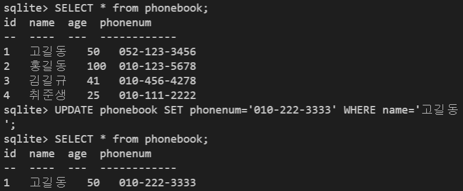


### WHERE

> WHERE 활용

Q : phonebook 테이블에서 age가 30 이상인 유저의 모든 컬럼 정보를 조회하려면?

A : `SELECT * FROM phonebook WHERE age >= 30;`

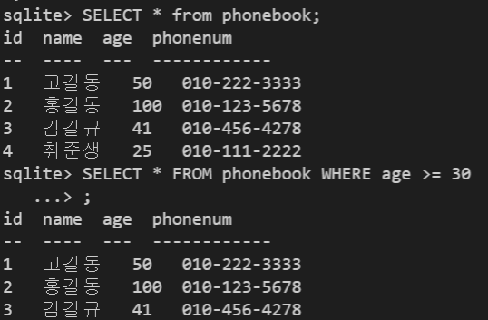

Q : phonebook 테이블에서 age가 30 이상이고 성이 '김'인 사람의 나이와 이름을 조회하려면?

A : `SELECT age, name FROM phonebook WHERE age >= 30 and name LIKE '김%';`

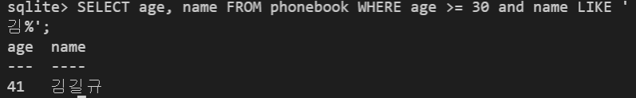


### <span style="color:blue">SQLite Aggregate Functions</span>

- COUNT
  - 그룹의 항목 수를 반환
- AVG
  - 값 집합의 평균 값을 계산
- MAX, MIN
  - 그룹에 있는 모든 값의 최대값, 최소값을 반환
- SUM
  - 모든 값의 합을 계산

> COUNT, AVG, SUM, MIN, MAX

```sqlite
SELECT COUNT(컬럼) FROM 테이블이름;
SELECT COUNT(name) FROM phonebook;
SELECT COUNT(*) FROM phonebook; -- 레코드의 총 개수 조회 --
-- 해당 컬럼이 숫자(INTEGER)일 때만 사용 가능 --
SELECT MAX(age) FROM phonebook; -- age 컬럼 중 가장 큰 값 --

```

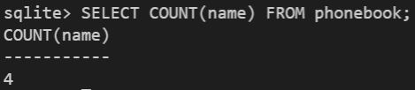

Q. 나이가 가장 많은 사람의 나이와 그 사람의 이름, 전화번호를 조회하려면?

A. `SELECT name, phonenum, MAX(age) FROM phonebook;`

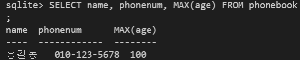


### LIKE operator

- 패턴 일치를 기반으로 데이터를 조회하는 방법

- sqlite는 패턴 구성을 위한 2개의 wildcards를 제공함

  - % : 0 개 이상의 문자, 이 자리에 문자열이 있을 수도, 없을 수도 있음

  - _ : 임의의 단일 문자, 반드시 이 자리에 한 개의 문자가 존재해야 함

Q. phonebook 테이블에서 나이가 20대인 사람만 조회한다면?

A. `SELECT * FROM phonebook WHERE age LIKE '2_';`

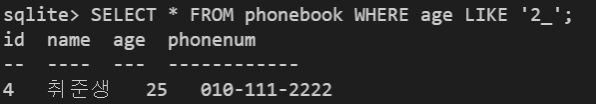


### ORDER BY

- 조회 결과 집합을 정렬
- SELECT 문에 추가하여 사용
- 정렬 순서를 위한 2개의 키워드 
  - ASC : 오름차순 (default)
  - DESC : 내림차순

Q. 나이를 오름차순 기준으로 데이터를 정렬하여 반환?

A. `SELECT * FROM phonebook ORDER BY age;`

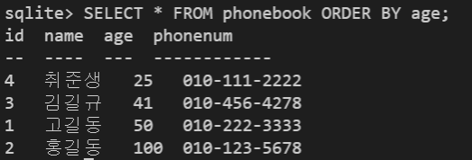

### GROUP BY

- 행 집합에서 요약 행 집합을 만듦
- SELECT 문의 optional 절
- 선택된 행 그룹을 하나 이상의 열 값으로 요약 행으로 만듦
- <span style="color:red">문장에 WHERE 절이 포함된 경우 반드시 WHERE 절 뒤에 작성!</span>

```sqlite
SELECT 컬럼1, aggregate_function(컬럼2) FROM 테이블 GROUP BY 컬럼1, 컬럼2;
-- 저장된 기준에 따라 행 세트를 그룹으로 결합, 데이터를 요약하는 상황에 주로 사용 --
```

Q. phonebook 테이블에서 동명이인인 사람이 몇명인지 반환

A. `SELECT name, COUNT(*) FROM phonebook GROUP BY name;`

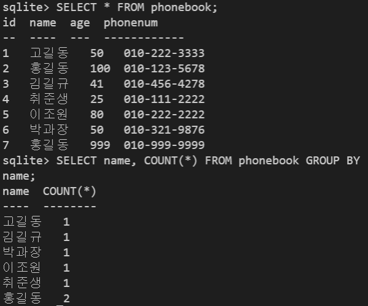


### <span style="color:blue">ALTER TABLE</span>

1. table 이름 변경
2. 테이블에 새로운 column 추가
3. column 이름 수정

```sqlite
-- 1. 테이블 이름 변경 --
ALTER TABLE phonebook RENAME TO addressbook;
-- 2. 테이블에 새로운 column 추가
ALTER TABLE addressbook ADD COLUMN location TEXT NOT NULL;
-- Error: Cannot add a NOT NULL column with default value NULL --
-- 기존 레코드들에 새로 추가할 필드에 대한 정보가 없기 때문에
-- 해결방법 : 1. NOT NULL 설정없이 추가하기, 2. default 설정하기 --
ALTER TABLE addressbook ADD COLUMN location TEXT NOT NULL DEFAULT '대한민국';

-- 3. column 이름 수정
ALTER TABLE table_name RENAME COLUMN current_name TO new_name;

```

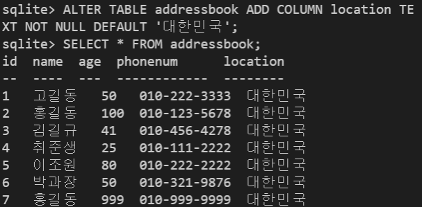


### <span style = "color:blue">SQL & ORM</span>

> Shell 정리 및 종료

- in sqlite

  - .shell clear
  - .exit

- in django_shell_plus

  - clear (`cls`)
  - exit

  

> Django Project Setting

```bash
$ pip install -r requirements.txt
$ python manage.py migrate
$ python manage.py sqlmigrate users 0001
$ sqlite3 db.sqlite3
```

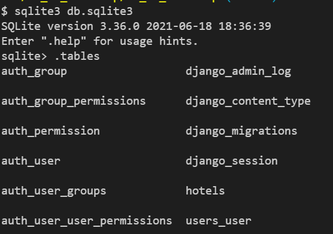

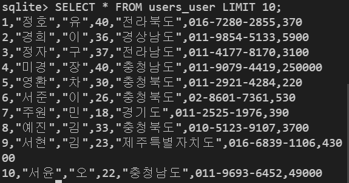


### READ

> 모든 user 레코드 조회 - ORM

- QuerySet으로 반환됨!

```python
User.objects.all()
```

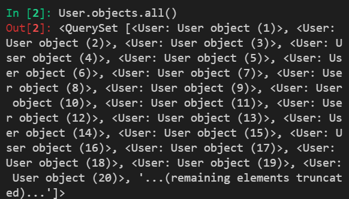

> 특정 user 레코드 조회 - ORM

```python
User.objects.get(pk=101)
```

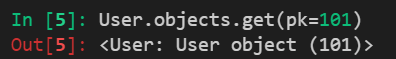

### CREATE

> user 레코드 생성

```python
User.objects.create(first_name='준생', last_name='취', age='25', country='대전', phone='010-123-5678', balance=10000)
# balance를 제외한다면 NOT NULL constraint 오류 발생
User.objects.create(first_name='준생', last_name='취', age='25', country='대전', phone='010-123-5678')
```

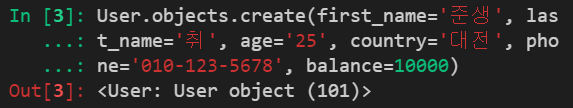

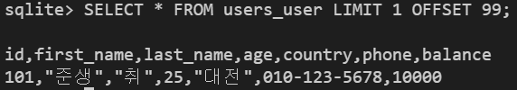

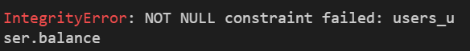


### UPDATE

> 특정 user 레코드 수정 - ORM

```python
user = User.objects.get(pk=101)
user.last_name = '김'
user.save()
user.last_name
```

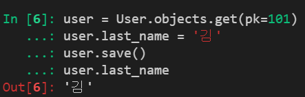

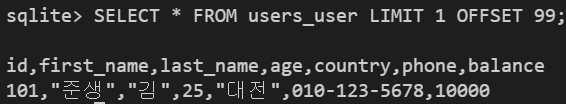


### DELETE

> 특정 user 레코드 삭제 - ORM

```python
User.objects.get(pk=101).delete()
```


### READ

> 나이가 30살인 사람들의 이름 -ORM

```python
User.objects.filter(age=30).values('first_name')
# SELECT first_name FROM users_user WHERE age = 30;
```

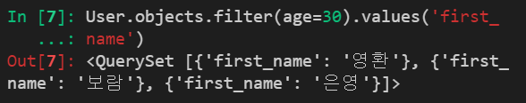


> 조건에 따른 쿼리문

- 대/소 관계 비교 조건
  - `__gte, __gt, __lte, __lt`

> 나이가 30살 이상인 사람의 인원 수 - ORM

```python
User.objects.filter(age__gte=30).count()
# SELECT COUNT(*) FROM users_user WHERE age >= 30;
```

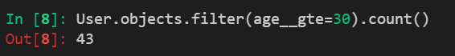


> AND

- 나이가 30살이면서 성이 김씨인 사람의 인원 수

```python
User.objects.filter(age=30, last_name='김').count()
# SELECT COUNT(*) FROM users_user WHERE age=30 AND last_name='김';
```

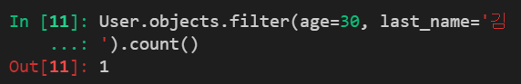


> OR

- 나이가 30살이거나 성이 김씨인 사람의 인원 수

```python
# OR을 활용하고 싶다면, Q object를 활용
from django.db.models import Q
User.objects.filter(Q(age=30) | Q(last_name='김')).count()
# SELECT COUNT(*) FROM users_user WHERE age=30 OR last_name='김';

```

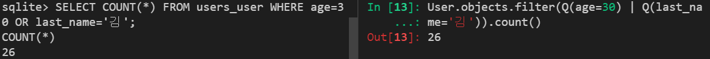


> LIKE

- 지역번호가 02인 사람의 인원 수

```python
User.objects.filter(phone__startswith='02-').count()
# SELECT COUNT(*) FROM users_user WHERE phone LIKE('02-%');
```

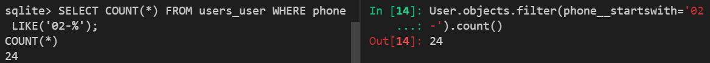


> 특정 컬럼 데이터만 조회하기

- 주소가 강원도이면서 성이 황씨인 사람의 이름

```python
User.objects.filter(country='강원도', last_name='황').values('first_name')
# SELECT first_name FROM users_user WHERE country='강원도' AND last_name ='황';
```


> 정렬, LIMIT, OFFSET

- 나이가 많은 사람 순으로 10명만 조회

```python
User.objects.order_by('-age')[:10]
#SELECT * FROM users_user ORDER BY age DESC LIMIT 10;
```

- 잔액이 적고, 나이가 많은 순으로 10명만 조회

```python
User.objects.order_by('balance','-age')[:10]
# SELECT * FROM users_user ORDER BY balance, age DESC LIMIT 10;
```

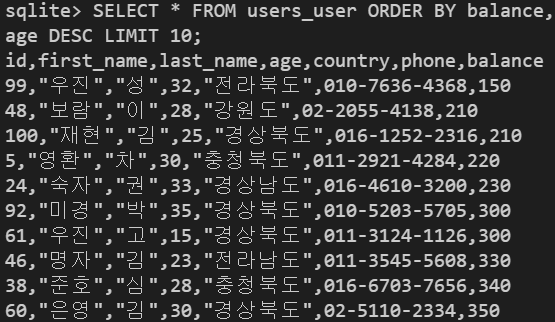

- 성, 이름 내림차순으로 5번쨰 있는 유저 정보 조회

```python
User.object.order_by('-last_name','-first_name')[4]
# SELECT * FROM users_user ORDER BY last_name DESC, first_name DESC LIMIT 1 OFFSET 4;
```

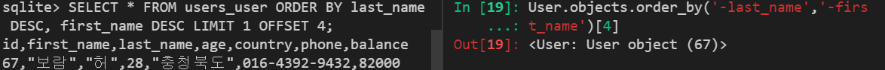


### Django Aggregation

> aggregate()

- '무언가를 종합, 집합, 합계' 등의 사전적 의미
- 특정 필드 전체의 합, 평균, 개수 등을 계산할 때 사용

> aggregate 사용하기

- 전체 유저의 평균 나이

```python
from django.db.models import Avg
User.objects.aggregate(Avg('age'))
# SELECT AVG(age) FROM users_user;
```

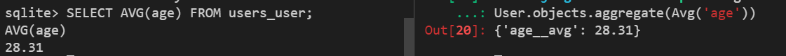


- 지역이 강원도인 유저들의 평균 계좌 잔고

```python
User.objects.filter(country='강원도').aggregate(Avg('balance'))
```

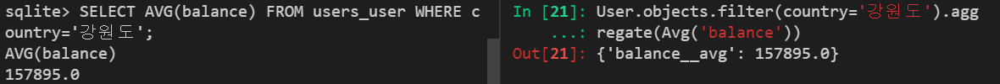


`Max, Sum` 등의 ORM Aggregate method 활용가능!


> annotate()

- '주석을 달다' 라는 사전적 의미
- 마치 컬럼 하나를 추가하는 것과 같음
  - 특정 조건으로 계산된 값을 가진 컬럼을 하나 만들고 추가하는 개념
  - <span style="color:blue">원본 테이블이 변하는 것이 아님</span>
- annotate()에 대한 각 인자는 반환되는 QuerySet의 각 객체에 추가될 주석임

```python
User.objects.values('country').annotate(Count('country'))
# SELECT country, COUNT(country) FROM users_user GROUP BY country;
```

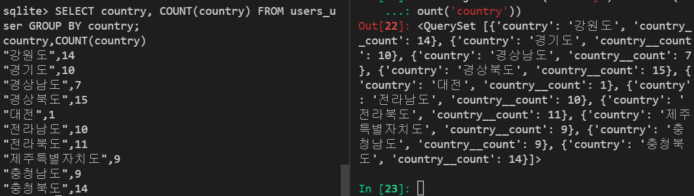