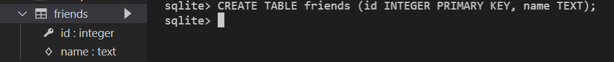
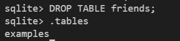
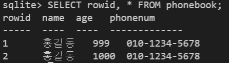

# SQLlite3 실습 

### DB 생성하기


```bash
$ sqlite3 tutorial.sqlite3 #있으면 열고, 없으면 해당 이름으로 생성
```

```sqlite
.database -- '.'은 sqlite 프로그램의 기능을 실행 -> DB 생성 --
```


> **CSV 파일을 table로 만들기**


```sqlite
.mode csv --데이터를 csv 형식으로 출력--
.import hellodb.csv examples -- examples 라는 테이블 생성 -- 
.tables -- 현재 DB에 있는 테이블 보여줌

-- SELECT 를 통해 특정 테이블의 레코드(행) 정보 반환하기 --
SELECT * FROM exmples; -- ;까지 해야 SQL 명령 쿼리로 완성됨 --
```


> 터미널 view 변경하기

```sqlite
.headers on
.mode column -- column 형태로 데이터 view
```


> **table 생성 및 삭제**

- CREATE

```sqlite
CREATE TABLE friends (id INTEGER PRIMARY KEY, name TEXT);
```



- 특정 테이블의 schema 조회

```sqlite
.schema friends
```


- DROP

```sqlite
DROP TABLE friends;
```



- 테이블 생성 실습

```sqlite
CREATE TABLE phonebook (name TEXT, age INT, phonenum TEXT);
```


### CRUD (e.g. DML : Data Manipulation Language) 로직 실습

> CREATE

- INSERT : 테이블에 단일 행 삽입

Q : phonebook 테이블에 이름이 홍길동이고 나이 999살, 전화번호 : 010-1234-5678인 데이터 넣기

```sqlite
INSERT INTO phonebook (name, age, phonenum) VALUES ('홍길동', 999, '010-1234-5678');
```


```sqlite
INSERT INTO phonebook VALUES ('홍길동', 1000, '010-1234-5678'); -- 모든 열에 데이터가 있는 경우 column을 명시하지 않아도 됨! --
```


- id는 어디에 있지? -> rowid로 SQLite가 따로 관리

```sqlite
SELECT rowid, * FROM phonebook;
```



> NULL

- 꼭 필요한 정보라면 공백으로 비워두면 안되기 때문에 NOT NULL 설정이 필요하다.

```sqlite
DROP TABLE phonebook
CREATE TABLE phonebook(id INTEGER PRIMARY KEY, name TEXT NOT NULL, age INT NOT NULL, phonenum TEXT NOT NULL);
```


> SELECT와 같이 사용하는 clause

- LIMIT

  - 쿼리에서 반환되는 행 수를 제한

  - 특정 행부터 시작해서 조회하기 위해 `OFFSET`키워드와 함께 사용하기도 함

```sqlite
SELECT * FROM phonebook LIMIT 2;
```


- Where
  - 쿼리에서 반환된 행에 대한 특정 검색 조건을 지정

```sqlite
SELECT * FROM phonebook WHERE phonebook.name LIKE '홍%'; 
```


- SELECT DISTINCT
  - 조회 결과에서 중복 행을 제거
  - DISINCT 절을 SELECT 키워드 바로 뒤에 작성해야 함

```sqlite
SELECT DISTINCT name FROM phonebook;
```


> DELETE

- 테이블에서 행을 제거

Q: phonebook 테이블에서 id가 5인 레코드를 삭제하시오.

A : `DELETE FROM phonebook WHERE id='5';`


- SQLite에서는 지워진 키를 재사용할 수 있음(기본적인 `rowid`인 경우에도)


> AUTOINCREMENT

- SQLite가 사용되지 않은 값이나 이전에 삭제된 행의 값을 재사용하는 것을 방지

```sqlite
CREATE TABLE 테이블이름 (id INTEGER PRIMARY KEY AUTOINCREMENT, ...);
-- 테이블을 생성하는 단계에서 AUTOINCREMENT를 통해 설정 가능 --
```


> UPDATE

- 기존 행의 데이터를 수정
- `SET` clause에서 테이블의 각 열에 대해 새로운 값을 설정
- `UPDATE 테이블이름 SET 컬럼1=값1, 컬럼2=값2, ... WHERE 조건;`

```sqlite
UPDATE phonebook SET phonenum='010-222-3333' WHERE name='고길동';
```


### WHERE

> WHERE 활용

Q : phonebook 테이블에서 age가 30 이상인 유저의 모든 컬럼 정보를 조회하려면?

A : `SELECT * FROM phonebook WHERE age >= 30;`


Q : phonebook 테이블에서 age가 30 이상이고 성이 '김'인 사람의 나이와 이름을 조회하려면?

A : `SELECT age, name FROM phonebook WHERE age >= 30 and name LIKE '김%';`


### SQLite Aggregate Functions